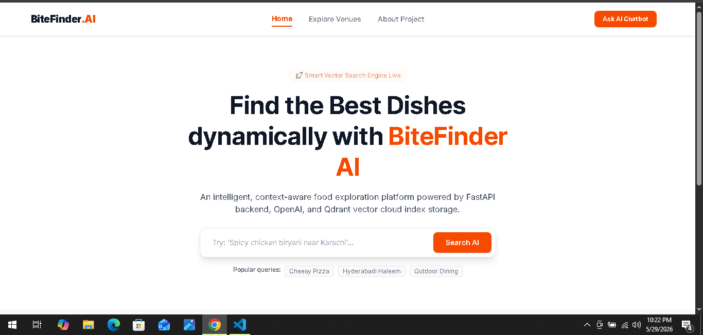
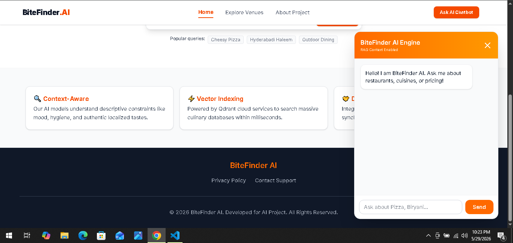
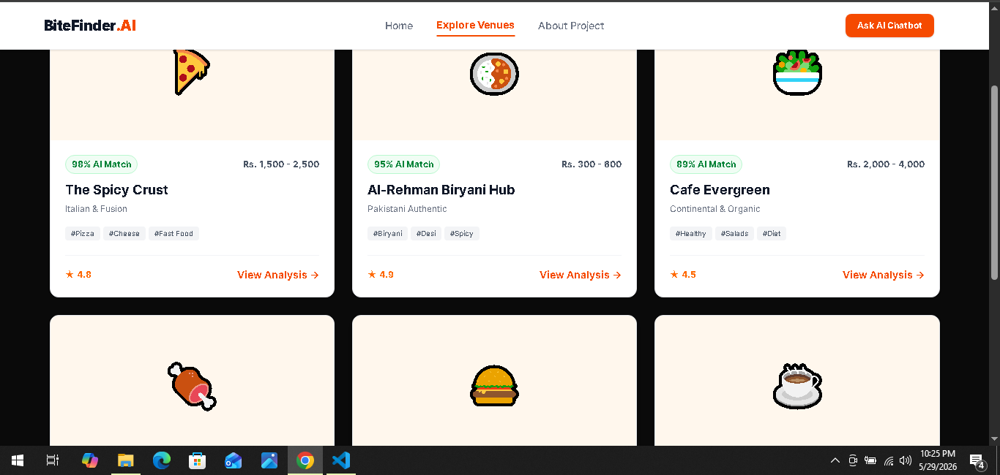

# BiteFinder AI - AI-Driven Restaurant Finder

BiteFinder AI is a complete, functional website developed using AI-powered development tools and modern web technologies. This platform empowers food enthusiasts to discover highly contextualized restaurant information through structural AI architectures and optimized RAG vector pipelines.

-----------------------------------------------
Group info:
Member1: Muhammad Talha Shaikh (BSE-23S-143)
Member2: Muhammad Saqib Qayyum (BSE-23S-142)

SECTION: SE7C
COURSE: Artificial Intelligence
DATE: 31 MAY 2026
Developed for the **Artificial Intelligence** course under the guidance of **Ma’am Mahnoor**.

-----------------------------------------------

## 🔗 Submission Links
- **Deployed Website (Vercel):** [https://bitefinder-project.vercel.app/]
- **Demo Video Link:** [https://drive.google.com/drive/folders/1xI9JaS7GeKXmuXnHda9cXlR4zWq4AZUH]
- **GitHub Repository:** [https://github.com/mtalhashaikh1/bitefinder-project]

---

## 📸 Interface Showcases (Screenshots)

### 1. Main Landing Platform (Homepage)


### 2. Conversational RAG Chatbot Engagement


### 3. Explore Restuarant Page


---

## 📜 Project Constitution (.spec/constitution.md)

### Mission
To empower food enthusiasts to discover highly contextualized restaurant information through structural AI architectures and optimized RAG vector pipelines.

### Core Principles
1. **Technical Transparency:** Every module must map structurally to a documented Spec-Kit tracking asset.
2. **Seamless UX:** Layout interfaces must render fast and switch smoothly across mobile and web viewports.
3. **Code Cleanliness:** Explicit typing via TypeScript and strict PEP8 guidelines for Python microservices.

### Technical Standards
- **Frontend:** Next.js 14 (App Router) + TypeScript + Tailwind CSS
- **Backend:** FastAPI Core Framework + Python Isolation Systems
- **Vector Core:** Qdrant Cloud Cluster Engine

### Design Guidelines
- Fluid layout architecture utilizing modern Tailwind design structures.
- Accessible icons using clean `lucide-react` metadata paths.

---

## 🛠️ Technical Stack & Development Tools
- **Frontend Framework:** Next.js 14+ (App Router), React 18+
- **Language & Styles:** TypeScript, Tailwind CSS, Lucide React (icons), clsx, tailwind-merge
- **Backend Infrastructure:** FastAPI (Python), Uvicorn Server
- **AI Core Systems:** OpenAI API (LLM Capabilities)
- **Vector database:** Qdrant Cloud (Free Tier)
- **Chat History Engine:** Neon Serverless Postgres
- **Development Tools:** Claude Code, Spec-Kit Plus, Git & GitHub, VS Code

---

## 📂 Project Structure

```text
bitefinder-project/
├── .spec/                     # Spec-Kit Plus Engineering Trackers
│   └── tasks/                 # Complete implementation logging files
│       ├── 001-setup-project.md
│       ├── 002-create-layouts.md
│       └── ...
│   ├── constitution.md        # Mission, Core Principles, and Rules
│   └── plan.md                # Phase breakdown and features checklist
├── app/                       # Next.js App Router Structure
│   ├── about/                 # About application view   page
│   ├── api/chat
│       └── route.ts
│   ├── contact/         
│   ├── restaurants/           # Specialized dynamic routes
│   ├── global.css             # Root global css
│   ├── layout.tsx             # Root layout settings
│   └── page.tsx               # Homepage UI
├── backend/                   # Intelligent Python FastAPI Server
│   ├── .env                   # Local environment secrets keys
│   ├── main.py                # Server initialization & core routes
├── components/                # Modular Reusable Interface Components
│   ├── ChatWidget.tsx         # Floating chatbot UI panel
│   ├── Footer.tsx
│   └── Navbar.tsx
├── public/                    # Static Assets & Screenshots
│   └── images/
├── package.json
└── README.md                  # Comprehensive Main Project Guide

📋 Development Plan & Personnel Matrix (.spec/plan.md) 

Personnel Responsibility Matrix:
Muhammad Talha Shaikh (BSE-23S-143) (Lead Developer): Next.js App Systems, Tailwind UI Controls, FastAPI Core Infrastructure.

Saqib Qayyum (BSE-23S-142) (Data & QA Engineer): Spec-Kit Logs Curation, Qdrant Collection Config, Mock JSON Datasets.

Phase Matrix Breakdown
Phase 1: Environment Logic Setup & Component Scaffolding (Day 1)
Phase 2: Frontend Route Completion & Viewport Optimization (Day 2)
Phase 3: Isolated AI Backend & Vector Memory Injection (Day 3-4)
Phase 4: Full App Integration, Testing, & Production Deployment (Day 5-6)

📋 Development Task Logs (.spec/tasks/)
The tracking registry reflects the logical task flow specified by the Spec-Kit paradigm alongside clear project structures.

# Task 001: Project Setup & Environment Logic                        by Saqib(BSE-23S-142)
# Task 002: Global App Layouts                                       by Talha(BSE-23S-143)
# Task 003: Build Homepage Hero Section & Search Engine Layout       by Talha(BSE-23S-143)
# Task 004: Develop Restaurant Listing Grid & Analytics Matrix       by Talha(BSE-23S-143)
# Task 005: Implement Individual Dynamic Content Routing Page        by Saqib(BSE-23S-142)
# Task 006: Build Contact Page and Core Navigation Matrix            by Saqib(BSE-23S-142)
# Task 007: Integrate RAG Chatbot Framework                          by Talha(BSE-23S-143)
# Task 008: Qdrant Vector Cloud and OpenAI API Integration           by Saqib(BSE-23S-142)
# Task 009: Neon Serverless Postgres Chat History Integration 
            & Vercel Deployment                                      by Talha(BSE-23S-143)


⚙️ Getting Started & Local Installation Guide:
Follow these sequential steps to initialize the core platform components, local servers, and runtime databases.

1. Initialize Project Directory & Repository
# Clone the project workspace
git clone [YOUR_GITHUB_REPOSITORY_URL]
cd bitefinder-project

# Install Frontend node packages dependencies
npm install lucide-react class-variance-authority clsx tailwind-merge

2. Initialize & Structure Spec-Kit Plus
# Initialize Spec-Kit tracks within the root directory spi init .
This generates and links the foundational structures inside the .spec/ directory container.

3. Backend Python Virtual Environment Configuration
cd backend
python -m venv venv

# Activate Virtual Environment (Windows PowerShell)
.\venv\Scripts\Activate.ps1

# Activate Virtual Environment (Mac/Linux)
# source venv/bin/activate

# Install critical Python packages
pip install fastapi uvicorn qdrant-client openai pydantic psycopg2-binary

🔑 Environment Variables Setup:
Create an .env.local file in the frontend root and a .env file inside the backend/ directory configuration:

# Next.js Endpoint Mapping
NEXT_PUBLIC_API_URL=http://localhost:8000

# RAG Engine Secrets
OPENAI_API_KEY=your_secure_openai_api_key
QDRANT_HOST=your_qdrant_cloud_cluster_url
QDRANT_API_KEY=your_qdrant_db_secret_key
NEON_DATABASE_URL=your_serverless_neon_postgres_url

🚀 Running the Web Application Locally:
Initializing the Backend Microservice
From the backend/ terminal execution layer:
uvicorn main:app --reload --port 8000

Initializing the Frontend Client Engine
From a secondary terminal in the root path directory:
npm run dev

Open up your browser and interface with the web layout execution live on http://localhost:3000.

🧠 AI Interfacing Logs & Insights (Claude Code Integration):
Throughout the architecture pipeline orchestration, the project was highly optimized using the localized native terminal AI engine assistant:
# Spin up the contextual command line agent terminal loop
claude code

Engineering Assistant Prompts Executed:
Prompt 1: "Please read through .spec/constitution.md and build out the dynamic Next.js components incorporating fluid responsive Tailwind structures matching our technical design directives."

Prompt 2: "Analyze the system specifications framework to establish an active, asynchronous React hook payload transmission communicating cleanly with our Python FastAPI /chat endpoint."

🔗 Learning Resources & Official Documentation:
1.Spec-Kit Plus Track Methodology: Spec-Kit Official Site
2.Claude Code Developer System: Claude Product Hub
3.Next.js 14 Framework Layouts: Next.js Documentation
4.Tailwind Utility Design Engines: Tailwind CSS System
5.FastAPI Core Application Layer: FastAPI Framework Docs
6.Vector Search Contextual Indexes: Qdrant Cloud Engine
7.Serverless PostgreSQL Clusters: Neon Serverless Database
